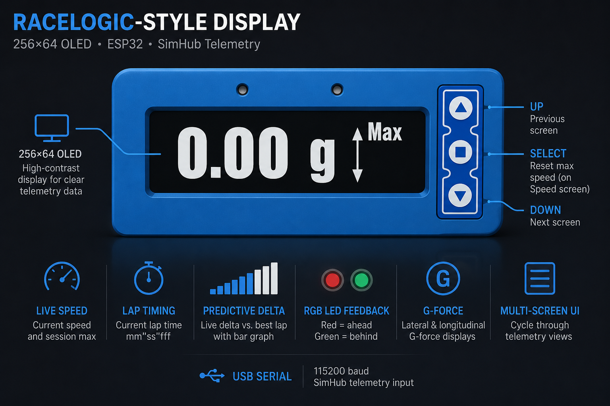

<p align="center">
  
</p>

# racelogic-esp32

ESP32 firmware that drives a physical RaceLogic-style telemetry display for sim racing. Live data is streamed from [SimHub](https://www.simhubdash.com/) over serial and rendered on a 256×64 OLED, with NeoPixel LEDs for predictive lap-delta feedback.

## Features

- **Live speed** — current speed and session max (reset with SELECT)
- **Predictive lap timing** — delta vs. all-time best lap, with bar graph and RGB LED feedback
- **Lap timing** — current lap time (`mm"ss'fff`)
- **Lap count** — current lap and total completed laps
- **G-force displays** — lateral and longitudinal G as numeric values and bar graphs
- **Animated splash screen** — logo animation on boot
- **Multi-screen UI** — cycle through views with UP / DOWN buttons

## Hardware

| Component | Model / notes |
|-----------|---------------|
| Microcontroller | ESP32 (Arduino framework) |
| Display | Newhaven **NHD-256x64** OLED (SSD1322, 4-wire SPI) |
| Buttons | 3× momentary (UP, SELECT, DOWN) |
| LEDs | 2× NeoPixel (WS2812-style) on a single data pin |
| Host connection | USB serial from PC running SimHub |

## Pinout

| Signal | GPIO |
|--------|------|
| Display CS | 5 |
| Display DC | 13 |
| Display RESET | 12 |
| Button DOWN (next screen) | 27 |
| Button SELECT | 26 |
| Button UP (previous screen) | 25 |
| NeoPixel data | 16 |

Display uses hardware SPI (SCK/MOSI on the default ESP32 SPI pins).

## Dependencies

Install these libraries through the Arduino Library Manager (or PlatformIO equivalent):

- [U8g2](https://github.com/olikraus/u8g2) — SSD1322 display driver
- [Adafruit NeoPixel](https://github.com/adafruit/Adafruit_NeoPixel) — RGB LED strip

> **U8g2 setup:** enable `U8G2_16BIT` in `u8g2.h` before building. The display constructor in `racelogic-esp32.ino` depends on it.

## SimHub configuration

1. Connect the ESP32 to your PC via USB.
2. In SimHub, add a **Serial** output device pointing at the ESP32 COM port.
3. Set the baud rate to **115200**.
4. Use the following custom serial format in SimHub:

```
'<'+
truncate([SpeedLocal]) +'\t'+
truncate([MaxSpeedLocal]) +'\t'+
format([CurrentLapTime],'mm\\"ss"\'"fff') + '\t'+
format([CurrentLap],'000') + '\t'+
format([CompletedLaps],'000') + '\t'+
format([GameRawData.Physics.AccG01], '0.00') + '\t'+
format([GameRawData.Physics.AccG03], '0.00') + '\t'+
isnull([PersistantTrackerPlugin.AllTimeBestLiveDeltaSeconds],0) +'\t'+
isnull([PersistantTrackerPlugin.AllTimeBestLiveDeltaProgressSeconds],0) +'\t'+
[GameRawData.Physics.PacketId] + '>\n'
```

> See `Simhub.txt` for a partial reference. The formula above is the complete format expected by the firmware.

### Serial protocol

Each line is tab-separated, wrapped in angle brackets:

```
<speed\tmaxSpeed\tlapTime\tcurrentLap\tcompletedLaps\tlateralG\tlongitudinalG\tliveDelta\tliveDeltaProgress>
```

| Field | Description |
|-------|-------------|
| `speed` | Current speed (local units) |
| `maxSpeed` | Session max speed |
| `lapTime` | Current lap time |
| `currentLap` | Current lap number (zero-padded) |
| `completedLaps` | Total completed laps (zero-padded) |
| `lateralG` | Lateral acceleration (G) |
| `longitudinalG` | Longitudinal acceleration (G) |
| `liveDelta` | Live delta vs. best lap (seconds) |
| `liveDeltaProgress` | Delta progress used for NeoPixel feedback |

## Getting started

1. Wire the display, buttons, and NeoPixels according to the pinout above.
2. Open `racelogic-esp32.ino` in the Arduino IDE (or import into PlatformIO).
3. Install the required libraries and enable `U8G2_16BIT`.
4. Select your ESP32 board and upload the firmware.
5. Configure SimHub as described above and start a session.

## Usage

| Button | Action |
|--------|--------|
| **DOWN** | Next screen |
| **UP** | Previous screen |
| **SELECT** | Reset max speed (on Speed screen) |

On the **Predictive Lap Timing** screen, the NeoPixels indicate delta progress:

- **Red** — ahead of (or matching) your best lap
- **Green** — behind your best lap

## Project structure

```
racelogic-esp32/
├── racelogic-esp32.ino   # Main firmware — screens, serial parsing, UI loop
├── animation.ino         # Boot splash animation
├── Simhub.txt            # SimHub serial format reference
├── fonts/                # Bitmap fonts (Impact / Arial, racing-display style)
└── graphics/
    ├── logo.h            # Static logo
    └── animated_logo/    # 16-frame animated splash sequence
```

## Screens

| # | Screen | Description |
|---|--------|-------------|
| 0 | Speed | Live speed + session max |
| 1 | Predictive Lap Timing | Delta bar + NeoPixel feedback |
| 2 | Lap Timing | Current lap time |
| 4 | Lap Count | Current and total laps |
| 5 | Lateral G Bar | Lateral G force bar graph |
| 6 | Longitudinal G Bar | Longitudinal G force bar graph |
| 7 | Lateral G | Lateral G numeric value |
| 8 | Longitudinal G | Longitudinal G numeric value |

## Acknowledgments

Inspired by [RaceLogic](https://www.racelogic.co.uk/) performance displays. Telemetry routing powered by [SimHub](https://www.simhubdash.com/).
